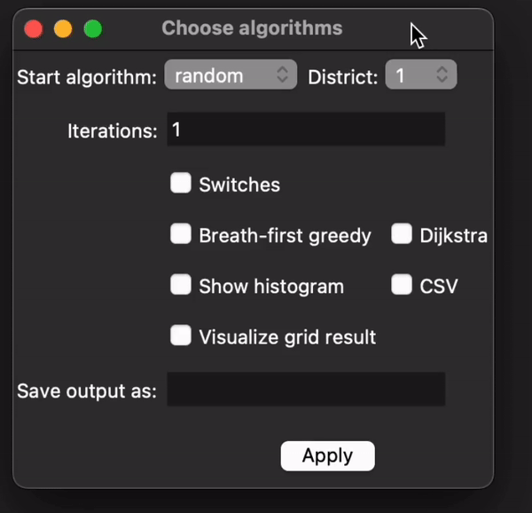
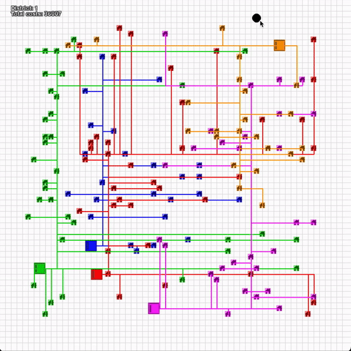

# SmartGrid - circuit-solvers-

Groene energie, opgewekt door huishoudelijke installaties zoals zonnepanelen, creëert vaak overschotten. Om deze pieken in energieproductie te beheren, worden batterijen gebruikt. Zo wordt zelfvoorziening efficiënter. Met het smart grid worden huizen via kabels gekoppeld aan een batterij. Voor een feasibility study zijn drie dummy-woonwijken opgesteld, met daarin vijf batterijen. De huizen hebben zonnepanelen met een maximale output, de batterijen hebben een maximale capaciteit. Het leggen van kabels levert kosten op, evenals de batterij. Met dit algoritme wordt geprobeerd om de kabels optimaal van huis tot batterij te verbinden en de kosten zo laag mogelijk te houden.

***

### Vereisten

Deze codebase is volledig geschreven in Python 3.7. In requirements.txt staan alle benodigde packages om de code succesvol te draaien. Deze zijn gemakkelijk te installeren via pip dmv. de volgende instructie:

```
pip install -r requirements.txt
```

Of via conda:

```
conda install --file requirements.txt
```

** De code werkt alleen via een linux environment: (ubuntu / macos M1+) **

***

### Algoritmes
#### GRID VULLEN
- `Greedy`: vult het hele grid op greedy mannier
- `Random`: vult het hele grid op random mannier

#### OPTIMALISATIE
- `Switch Pairs`: optimaliseert gevuld grid met wisselen van huizen

#### OPTIMALISEER DELEN VAN KABELS
- `Breath first greedy`: optimaliseert gevuld grid door huizen 
connecten aan main branch(es)
- `Dijkstra`: Verbind kabels met dijkstra's kortste pad


##### note:
- Meerdere algorithmen kunnen worden gecombineerd
- Random kan met meerdere iteraties worden gebruikt, dit maakt gebruik van **multiprocessing**

***

### Gebruik

Het programma kan worden aangeroepen met 'python main.py'
Hiermee wordt een interface gegeven en kan de gewenste combinatie gekozen worden:

<div align="center">
    
</div>

OF het aanroepen met cmd line argumenten na 'python main.py':

```
Usage: python [option] [district]

        -g          Selects the greedy algorithm to fill grid
        -r          Selects the random algorithm to fill grid
        -i          Selects existing file output as input to fill grid, default: most recent

        -f <name>   Selects a different specified filename for '-i'
        -n <int>    Selects the amount of iterations for the random algorithm '-r'
        -s          Selects the switches algorithm after a filled grid

        -b          Selects the breath-first greedy algorithm after a filled grid
        -m <int>    Selects an amount <1-5> of main branches breath_first_greedy uses '-b'
        -d          Selects the Dijkstra algorithm after a filled grid

        -o <name>   Give name for the output file 
        
        -v          Visualizes the result with pygame
        -c          Writes out random result to csv file in outputs
        -p          Shows a histogram of random iterations [-r -n <amount>]

        -h          Shows this message
```

#### **Stap 1:** Kies één
- **`'-g'`** of **`'-r' ('-n' <iterations>)`** of **`'-i' ('-f' <name>)`**

#### **Stap 2:** Kies
- wel of niet **`-s`** 

#### **Stap 3:** Kies één
- **`-b (-m <main branches>)`** of **`-d`**

#### **Stap 4:** Kies welke
- **`-o <name>`** en/of **`-v`** en/of **`-p`**

#### **Stap 5:** Kies één district nummer
- **`<1-3>`**

#### **Voorbeelden:**
- *Greedy Algorithm op district 1:* `python main.py '-g' 1`
- *Random Algorithm met 10 iterations en Histogram op district 1:* `python main.py '-r' '-n' 10 '-p' 1`
- *Breath-First Greedy Algorithm op previous run file met 3 main branches en Visualization, met 'important' als output naam op district 2:* `python main.py '-i' '-b' '-m' 3 '-o' important '-v' 2`

***

### Visualisatie

- Met de interactieve pygame visualisatie kan het smart grid worden gevisualiseerd
- Met het bewegen van de cursor over een batterij, kunnen specifieke eigenschappen worden weergenomen:

<div align="center">
    
</div>


***


### Structuur

De hierop volgende lijst beschrijft de belangrijkste mappen en files in het project, en waar je ze kan vinden:

- **/code**: bevat alle code van dit project
  - **/code/algoritmen**: bevat de code voor algoritmes
  - **/code/classes**: bevat de drie benodigde classes voor deze case
  - **/code/vizualization**: bevat de pygame code voor de visualisatie
- **/data**: bevat de verschillende databestanden die nodig zijn om het grid te vullen en te visualiseren

***

### Auteurs
- Jens Bloemen
- Annelaure van Overbeeke
- Salomé Poulain